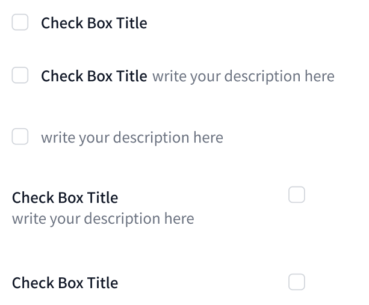
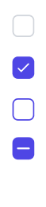

# Checkbox

基礎多選框

## 基礎樣式

### Import

```jsx
import Checkbox from './UI/Checkbox.vue'
```


<div style="display: flex;">
    <div style="flex: 2;">
        
    </div>
	<div style="flex: 1;">
        
    </div>
    <div style="flex: 2;">
        <ul>
            <li>
                check: left / text: title
            </li>
            <li>
                check: left / text: both
            </li>
            <li>
                check: left / text: desc
            </li>
            <li>
                check: right/ text: both
            </li>
            <li>
                check: right/ text: title
            </li>
        </ul>
    </div>
</div>

<!-- - check: left / text: title
- check: left / text: both
- check: left / text: desc
- check: right/ text: both
- check: right/ text: title -->


### 樣式props
| prop name | type | 變數 | 功能 |
| :-- | :-- |:--| :--|
| checkIcon | String | `check (default)` `line` | 勾選樣式: check:勾 / line: 平行線 |
| check | String | `left (default)` `right` | 勾選框位置 |
| text | String | `title (default)` `desc` `both` | 字體樣式 |


::: tip ❗注意
 樣式props不可隨意混用 
:::


::: tip 
如要使用required，需引用checkbox.js的`updateCheckbox(errorValue, checkValue)`函式  
在引用元件上加上`onChange`，可加上`hasError`改變樣式一起使用
:::

```html
//required checkbox example

<script setup>
	import CheckBox from './UI/Checkbox.vue';
	import { updateCheckbox } from './function/checkbox'
	import { ref } from 'vue';
	
	const showError = ref(false);
	const isCheck = ref(false);

</script>

<template>

	<Checkbox 
		check="left" text="both" 
		v-model="isCheck" :required="true" :hasError="showError"
		@change="updateCheckbox(showError, isCheck)"
	></Checkbox>

</template>
```

### 資料設定

**v-slot**

`title (default)` :  大標題 

`desc` : 註解

**取用勾選時布林值**

- v-model
- ref

### 資料props
| prop name | type | 變數 | 功能 |
| :-- | :-- |:--| :--|
| name | String | 自行設定 | 傳資料用，同html屬性 |
| required | Boolean | `true` `false (default)` | 必填 |
| hasError | Boolean | `true` `false (default)` | 紅色框線提示 |

**複合元件**  
[Checkbox 全選](../compo/checkAll.md)