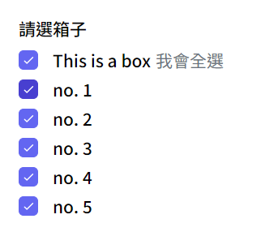
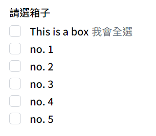

# Checkbox 全選

可全選的勾選列表

**基礎樣式** [Checkbox](../basic/checkbox.md) 

### Import

```jsx
import CheckSet from './UI/CheckSet.vue'
```

```jsx
<CheckSet 
	:data="formStore.checkArray"
  check="left" master-text="both" text="title"
  label-txt="請選箱子"
></CheckSet>
```
<div style="display: flex; margin-top: 22px;">
  <div style="flex: 1;">
    
  </div>
  <div style="flex: 1;">
    
  </div>
  <div style="flex: 1;">
    
  </div>
</div>

### 樣式props
| prop name | type | 變數 | 功能 |
| :-- | :-- |:--| :--|
| check | String | `left (default)` `right` | 勾選框位置 |
| master-text | String | `title (default)` `desc` `both` | 全勾選欄字體樣式 |
| text | String | `title (default)` `desc` `both` | 字體樣式 |

### 資料props
| prop name | type | 功能 |
| :-- | :-- |:--| :--|
| data | Array | 傳入資料，需有標題`title(String)`, `敘述desc(String)`, `值value(String)` |
| label-txt | String | 列表標題 |
| required | Boolean | 必填 |
| hasError | Boolean | 提示框線 |