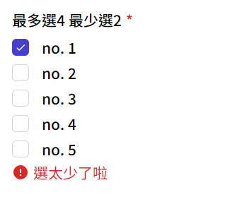

# Checkbox 限制勾選

限制勾選數量的勾選列表
超過數量會鎖勾選框

### Import

```jsx
import CheckLimit from './UI/CheckboxLimit.vue'
```

```jsx
<CheckLimit 
	:data="formStore.checkArray2" text="desc" 
	:max="4" :min="2"
	label-txt="最多選4 最少選2"
	error-less="選太少了啦"
	required
></CheckLimit>
```

### 

<div style="display: flex; margin-top: 22px;">
  <div style="flex: 1;">
    
  </div>
  <div style="flex: 1;">
    
  </div>
  <div style="flex: 1;">
    
  </div>
</div>

### 樣式props
| prop name | type | 變數 | 功能 |
| :-- | :-- |:--| :--|
| check | String | `left (default)` `right` | 勾選框位置 |
| text | String | `title (default)` `desc` `both` | 字體樣式 |

### 資料props
| prop name | type | 功能 |
| :-- | :-- |:--| :--|
| data | Array | 傳入資料，需有標題`title(String)`, `敘述desc(String)`, `值value(String)` |
| label-txt | String | 列表標題 |
| error-less | String | 少於勾選數量警告 |
| max | Number | 最多勾選數量 |
| min | Number | 最少勾選數量 |
| required | Boolean | 必填 |