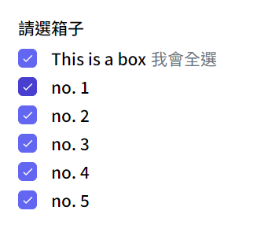
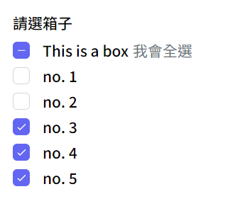
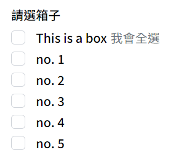

# Radio Set

單選列表

**基礎樣式** [Radio button](../basic/radiobutton.md) 

### Import

```jsx
import radioSet from './UI/RadioSet.vue'
```

```jsx
<radioSet 
    :data="radioArray"
    name="boxes"
    radio="left" text="desc" label-txt="三選一"
>
</radioSet>
```

<!-- 圖片 -->
<!-- <div style="display: flex; margin-top: 22px;">
  <div style="flex: 1;">
    
  </div>
  <div style="flex: 1;">
    
  </div>
  <div style="flex: 1;">
    
  </div>
</div> -->

### 樣式props
| prop name | type | 變數 | 功能 |
| :-- | :-- |:--| :--|
| radio | String | `left (default)` `right` | 單選鈕位置 |
| text | String | `title (default)` `desc` `both` | 字體樣式 |

### 資料props
| prop name | type | 功能 |
| :-- | :-- |:--| :--|
| data | Array | 傳入資料，需有標題`title(String)`, `敘述desc(String)`, `值value(String)` |
| label-txt | String | 列表標題 |
| required | Boolean | 必填 |
| tatilHint | String | 提示字 `optional` |